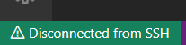

# Vagrant (Linux)

This project contains the files required to create and provision a Vagrant virtual machine running Linux.  Before running the initial *vagrant up* command, the following prerequisites must be installed:

- [Hashicorp Vagrant](https://www.vagrantup.com/downloads)
- A virtual machine hosting environment.  This installation was tested using [Oracle VirtualBox](https://www.virtualbox.org/wiki/Downloads).
- The host machine must have a dedicated vagrant public/private key pair named *VagrantKey* in its .ssh folder (i.e. *C:\Users\\{YourUserName}\\.ssh*)

Because the virtual machine is intended for repeatable software development across multiple installations, its characteristics are locked down in the various provisioning scripts and configuration options.

## Quick Start

- Download and install the noted prerequisites
- Use *ssh-keygen* to create the needed *VagrantKey* files in the host .ssh folder
- Download this project into a host directory
- Using a command prompt, navigate to the project directory and run the *vagrant up* command.  This will create the virtual machine and run the *VagrantProvision* bash script to provision it.
- When the installation completes, enter the *vagrant ssh-config* to obtain the SSH parameters needed to connect to the virtual machine

The virtual machine is now running and ready for use.

## Visual Studio Code

To seamlessly use the virtual machine with Visual Studio code, a few more steps are required:

- Install a Visual Studio Code SSH plugin.  This was tested with the Microsoft *ms-vscode-remote.remote-ssh* plugin
- Run Visual Studio Code and click the remote SSH status bar at the lower left corner of the window

- When the SSH menu appears, click *Open SSH Configuration File...*
- Select the SSH config file located in your user path (e.g. *C:\Users\<YourUserName>\.ssh\config*
- When the SSH config file opens, paste the previously obtained SSH information into it
- Edit the *IdentityFile* to point at the *VagrantKey* private key created in the prerequisites
- On the first line that reads *Host default*, *default* is the current alias of the SSH host (in this case, the guest virtual machine) that Visual Studio Code uses to identify an SSH connection. Change this to something that specifically identifies this SSH host, as it is likely you will have multiple virtual machines in the future and you will need to be able to differentiate them.
- Save and close the config file

When Visual Studio Code connects to the virtual machine for the first time, the virtual machine downloads a tarball from the Microsoft server to facilitate the communication.  This can occasionally be problematic and a potential fix is to have Visual Studio Code download the tarball itself and transfer it.  This option is controlled by the *Remote.SSH: Local Server Download* configuration setting.

## Synced Folders

The virtual machine uses a series of synced folders to share data between the host and virtual machine.  The following synced folders are in effect:
| Host Folder | Guest Folder | Comments |
| ----------- | ----------- |-----------|
| $VagrantDir | vagrant | The host folder containing the Vagrant file.  This is always shared by default. |
| C:\GitProjects | /host/vagrant/GitProjects | This is the root folder for all Git projects

## Misc. Provisioning

The provisioning process will copy the host side .gitconfig file to the guest machine.  This will generally allow the guest to interact with the local repository shared with the host machine via synched folders, but may not be sufficient for remote servers such as GitHub, GitLab, etc., depending on their setup.  Future enhancements may involve the use of dedicated key sets, but until that time, use a host side tool to push changes to your remote.

## Supported Development Environments

Virtual machines created from this project are explicitly configured to support the following development environments:

| Tool | Version | Comments |
| ----------- | ----------- |-----------|
| Distribution | Ubuntu 20.04 | Focal Fossa LTR |
| Kernel | v5.4.0-90 | |
| Python3 | v3.9.9 | Includes PIP |
| gcc-9 | v9.3.0 | |
| g++-9 | v9.3.0 | |
| gcc-11 | v11.1.0 | |
| g++-11 | v11.1.0 | |
| Make | v4.2.1 | |
| CMake | v3.16.3 | |

The base box may by default support other environments (e.g. C, C++, Python 2, etc.), but those are not explicitly controlled by the provisioning process.
